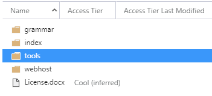
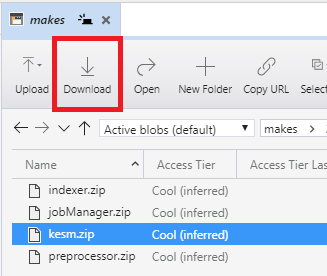

# Deploying a basic MAKES instance to Azure from your Subscription

 Step-by-step guide for deploying a MAKES instance from a Microsoft Academic Knowledge Exploration Service (MAKES) release. For more information on obtaining a MAKES release, visit [Sign up for MAKES](get-started-setup-provisioning.md)

## Prerequisites

- [Microsoft Academic Knowledge Exploration Service (MAKES) subscription](get-started-setup-provisioning.md)

## Verify the current release

When new versions of MAKES are released, a new folder will be created in the "makes" blob container of your Azure Storage Account.  In this folder will be all of the elements required to self-host an instance of MAKES.  To get started, let's verify that MAKES has been pushed to your subscription successfully.

1. Open the [Azure portal](https://portal.azure.com) and navigate to Storage Accounts.

2. Find the Storage Account that you have set up to receive your MAKES subscription.

3. Open the Storage Account in *Storage Explorer*.  This might require you to download and install the tool if you have not installed it already.


- Once Storage Explorer has opened, verify that there is a blob container called "makes".


1. Open the "makes" blob container and verify there is at least one folder in that container.  This folder should be named by the date of the MAKES release.  Ex: 2020-01-10-prod

2. Open the 'dated' folder.

## Verify the folders and content

There should be four (4) folders and a licence:

- *grammar* - This folder holds the grammar files.

- *index* - This folder holds the index files.

- *tools* - This folder holds the scripts required to customize MAKES and deploy MAKES to Azure.

- *webhost* - This folder holds the files required to create the VM instance of MAKES.

- *License.docx* - Microsoft Word file with the license to use this data and software.



## Download the deployment script from your Azure Storage Account

Each MAKES deployment includes the scripts required to provision an instance of MAKES in Azure.  These tools are located in the 'tools' folder that you verified above.  To download the scripts, open the 'tools' folder, then open the 'kesm' folder.  Select the 'kesm.zip' file located in this folder from Storage Explorer and click 'Download' from the top ribbon:



Save this file to a local folder.

## Unzip the script package

Once the file has been downloaded you will need to extract the contents.  Right click on the kesm.zip file.  If you are using the Windows operating system select "Extract All" from the context menu.  If you are using a Mac, double-click the zip file and it will decompress into the same folder.  When extracted, you will see two folders, one for each environment we support.  Select win-x86 if you are using a Windows machine or osx-x64 if you will be running the script on a Mac and open the folder.  In this folder are two files: kesm.exe and kesm.pdb.  The kesm.exe file is script that we will be running to deploy MAKES.

## Run the script

At this point to are ready to deploy an instance of MAKES to your Azure account.  Open a command prompt (Windows) or terminal window (Mac) and navigate to the folder that you extracted the kesm.exe file to.

1. Execute the following command to create your hosting resources:

    ```cmd
    kesm.exe CreateHostResources --HostResourceName <makes_host_resource_group_name> --MakesPackage "https://<makes_storage_account_name>.blob.core.windows.net/makes/<makes_release_version>/"
    ```

    Example: **kesm.exe CreateHostResources --HostResourceName "contosorgmakesone" --MakesPackage "https://makesascontoso.blob.core.windows.net/makes/2020-01-30/"**

Replace the following tokens in the above command with the appropriate value:

| Token to relpace | Value |
| --------| ----- |
| <makes_host_resource_group_name> | The name of the Resource Group that will be created for this deployment. |
| <makes_storage_account_name> | The name of the storage account you downloaded the scripts from above. |
| <makes_release_version> | The MAKES release you would like to deploy. |

2. Copy the **Host Image Id** from the last line of output from the script, you will use it in the next command.  Ex:  **/subscriptions/<your_subscription_id>/resourceGroups/<makes_host_rource_group_name>/profiders/Microsoft.Compute/Images/<makes_host_rource_group_name>** 


3. Execute the following command to deploy your hosting resources:

    ```cmd
    kesm.exe DeployHost --HostName [makes_instance_host_name] --MakesPackage "https://<makes_storage_account_name>.blob.core.windows.net/makes/<makes_release_version>/"  --MakesHostImageId "<id_from_previous_command_output>"
    ```

    Example: **kesm.exe DeployHost --HostName contosomakes --MakesPackage "https://makesascontoso.blob.core.windows.net/makes/2020-01-30/" --MakesHostImageId "/subscriptions/00000000-0000-0000-0000-000000000000/resourceGroups/contosorgmakesone/profiders/Microsoft.Compute/Images/contosoImageName"**

Replace the following tokens in the above command with the appropriate value:

| Token to relpace | Value |
| --------| ----- |
| <makes_instance_host_name> | The host name for your service.  The hostname will be the host name of the server where your MAKES deployment will be hosted.  Ex: If you used 'contosomakes', your MAKES API will be hosted at http://contosomakes.westus.cloudapp.azure.net. |
| <makes_storage_account_name> | The name of the storage account you downloaded the scripts from above. |
| <makes_release_version> | The MAKES release you would like to deploy. |
| <id_from_previous_command_output> | The id you copied from the output of the previous command. |


At this point the tool will take care of creating all of the required resources and deploying MAKES.  During the initial run it can take up to 3 hours to complete this task.  On first run the script generates resources that you only need to create once.  Subsequent deployments to the same host will not take as long and should be much quicker, approximately 30 minutes->1 hour.  See the [Command line Reference](reference-makes-command-line-tool.md) for more details.  

> [!NOTE]
> To achieve the fastest instance start times, ensure that all resources (storage account, virtual machine scale set, etc.) are located in the same region. The "--Region" parameter controls which region new resources are created in. Visit the [Command line Reference](reference-makes-command-line-tool.md) section for full details on this and other parameters.

Depending on the region your storage account is in and the region you are deploying to, deployment may take longer as the default indexes are quite large and need to be copied.  By default, the tool deploys to the WestUS region of Azure.  For a reference of all the available parameters type:

```cmd
kesm.exe --help

// For command specific help; type the command, appending '--help'

kesm.exe DeployHost --help
```

Or, you can visit the [Command Line Tool(kesm.exe) Reference](reference-makes-command-line-tool.md).

## Verify your new instance of MAKES

1. Open a browser and go to the status URL for your new MAKES instance.  Ex: **http://<your_makes_public_IP_DNS>.<azure_region>.cloudapp.azure.com/status**. The "readyToServeRequest" property should be true.

2. Go to the details URL for your new MAKES instance and verify the version of the API. Ex: **http://<your_makes_public_IP_DNS>.<azure_region>.cloudapp.azure.com/details**.  In the description the created time should match the date of your release. _

3. Go to the base URL for your new MAKES instance and verify the API's are working as expected.  Ex: **http://<your_makes_public_IP_DNS>.<azure_region>.cloudapp.azure.com**


## Next steps

Check out the sample projects that leverages MAKES API.
