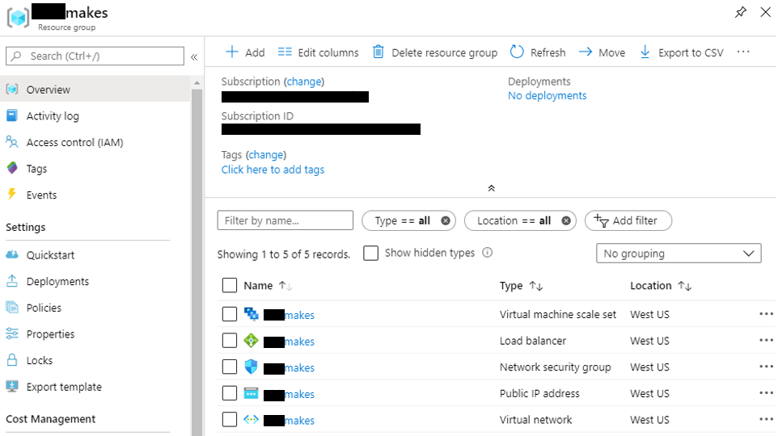

# How to delete a MAKES deployment

 Step-by-step guide for deleting a MAKES deployment created from MAKES command line tool. For more information on deploying a MAKES API instance, visit [Create an API Instance](get-started-create-api-instances.md)

## Prerequisites

- A MAKES API instance deployment

## Delete the resource group associated with the MAKES API instance

There should be two resource groups associated with a MAKES API instance, a resource group containing the MAKES hosting image and a resource group containing the MAKES API instance. Start with finding and deleting the resource group containing the MAKES API instance:

1. Open the [Azure Management Portal](https://portal.azure.com) and navigate to resource groups.

1. Find the resource group containing the MAKES API instance by searching for the "HostName" parameter used for host deployment(DeployHost command).  

1. Select and open the resource group containing the MAKES API instance.

    You should see the following MAKES API instance resources in the resource group:
    

1. Select "Delete resource group" and follow the prompt to delete the API instance resource group.

## Delete the resource group associated with the MAKES API hosting image

Once the API instance resource group is deleted, find and delete the resource group containing the MAKES hosting image.

1. Open the [Azure Management Portal](https://portal.azure.com) and navigate to resource groups.

1. Find the hosting image resource group by searching for "HostResourceName" parameter used for hosting resource deployment(CreateHostResources command).  

1. Select and open the resource group containing the MAKES API instance.

    You should see the MAKES hosting image resource in your hosting image resource group
    

1. Select "Delete resource group" and follow the prompt to delete the hosting image resource group.  
